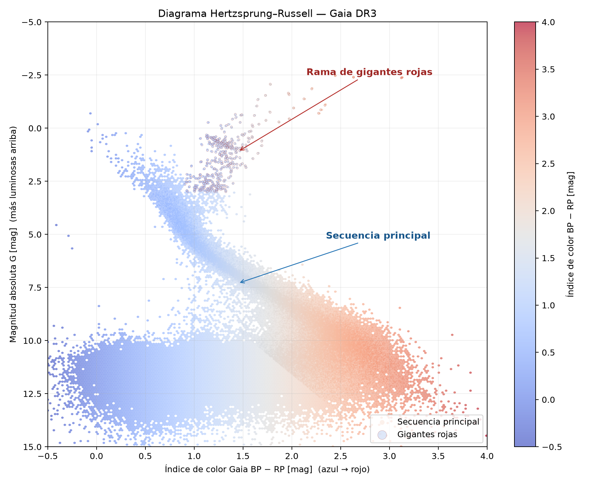

# Electiva de Minería de Datos

---

* **Misión:** Arqueología galáctica con Gaia DR3
* **Autor:** Carlos Orozco  
* **Versión:** 1.0

---

## Índice general

1. [Dependencias](#dependencias)
2. [Ejecución](#ejecución)
3. [Descripción general](#descripción-general)
4. [Documentación del endpoint](#documentación-del-endpoint)
5. [Construcción de la consulta](#construcción-de-la-consulta)
6. [Salidas esperadas](#salidas-esperadas)
7. [Resultado](#resultado)
8. [Análisis físico](#análisis-físico)

---
## Dependencias

La ejecución del proyecto requiere contar con las siguientes bibliotecas y dependencias:

- Bash.
- Python 3 o posterior.
- `wget` o `curl` para descargar el archivo CSV.
- Pandas.
- NumPy.
- Matplotlib.

<details>
<summary><strong>Instalación en macOS</strong></summary>

### 1. Instalar Homebrew

Si Homebrew todavía no está instalado:

```bash
/bin/bash -c "$(curl -fsSL https://raw.githubusercontent.com/Homebrew/install/HEAD/install.sh)"
```

### 2. Instalar las herramientas necesarias

```bash
brew install bash python wget
```

> `curl` viene instalado por defecto en macOS.

### 3. Instalar las bibliotecas de Python

```bash
python3 -m pip install pandas numpy matplotlib
```

</details>

<details>
<summary><strong>Instalación en Linux (Ubuntu/Debian)</strong></summary>

### 1. Actualizar la lista de paquetes

```bash
sudo apt update
```

### 2. Instalar las herramientas necesarias

```bash
sudo apt install -y bash python3 python3-pip wget curl
```

### 3. Instalar las bibliotecas de Python

```bash
python3 -m pip install pandas numpy matplotlib
```

</details>

<details>
<summary><strong>Verificar la instalación</strong></summary>

Comprobar las herramientas del sistema:

```bash
bash --version
python3 --version
wget --version
curl --version
```

Comprobar las bibliotecas de Python:

```bash
python3 -c "import pandas, numpy, matplotlib; print('Dependencias instaladas correctamente')"
```

</details>

---

## Ejecución

Desde la raíz del proyecto, se debe dar permiso de ejecución al pipeline y luego ejecutarlo:

```bash
chmod +x pipeline.sh
./pipeline.sh
```

El script descarga los datos, ejecuta `constructor_db.py` y finalmente ejecuta`analisis_visual.py`.

## Descripción general

Este proyecto implementa un pipeline reproducible para estudiar la evolución estelar mediante datos públicos de **Gaia DR3**. El flujo de trabajo descarga una muestra de un millon de elementos desde VizieR, limpia los registros incompletos, calcula la magnitud absoluta de cada estrella, almacena los datos necesarios en una base SQLite y genera un diagrama de Hertzsprung–Russell.

* La consulta se construyó utilizando el lenguaje **ADQL**. 
* Las columnas de interés fueron consultadas en el [catálogo Gaia DR3 disponible en VizieR](https://vizier.cds.unistra.fr/viz-bin/VizieR?-source=I%2F355).

Luego de revisar la documentación oficial de VizieR, se determinó que la tabla más adecuada para este análisis es `I/355/gaiadr3`, que corresponde al catálogo principal de fuentes de **Gaia DR3**. 

Esta tabla contiene información astrométrica y fotométrica de las fuentes observadas por la misión **Gaia**, necesaria para construir el diagrama de Hertzsprung–Russell:

- `Source`: identificador de la estrella.
- `Plx`: paralaje en milisegundos de arco.
- `Gmag`: magnitud aparente en la banda G.
- `BP-RP`: índice de color de Gaia.

---

## Documentación del endpoint

La descripción oficial de la tabla y de todos los campos disponibles puede
consultarse en los siguientes enlaces:

- [Columnas de la tabla `I/355/gaiadr3`](https://cdsarc.cds.unistra.fr/viz-bin/VizieR-3?-source=I%2F355%2Fgaiadr3): muestra el nombre, la unidad y la descripción de cada campo.
- [ReadMe oficial del catálogo Gaia DR3](https://cdsarc.cds.unistra.fr/viz-bin/ReadMe/I/355?format=html&tex=true): contiene la documentación completa del catálogo.
- [Documentación de TAPVizieR](https://tapvizier1.cds.unistra.fr/adql/about.html): explica el endpoint TAP, el lenguaje ADQL y el uso de nombres con caracteres especiales.
- [Ayuda de ADQL para VizieR](https://tapvizier1.cds.unistra.fr/adql/help.html): presenta instrucciones y ejemplos de consultas.

El endpoint síncrono utilizado por `pipeline.sh` es:

```text
https://tapvizier.cds.unistra.fr/TAPVizieR/tap/sync
```

La URL incluye un conjunto de parametros adicionales que facilitan la consulta:

* `request=doQuery`: Indica que la consulta será síncrona.
* `lang=ADQL`: Indica que se ejecutará una consulta ADQL
* `format=csv` Indica que respuesta debe entregarse en formato CSV.

---

## Construcción de la consulta

A continuación, se presenta la consulta original que se mapeó en la URL:

```sql
SELECT TOP 50000 Source, Plx, e_Plx, Gmag, "BP-RP"
FROM "I/355/gaiadr3"
```

---

## Salidas esperadas

Después de ejecutar el pipeline se generan los siguientes archivos:

- `resultados/gaia_dr3_crudo.csv`: descarga original de Gaia DR3. Este archivo se conserva
  al terminar el proceso.
- `resultados/datos_mision.db`: base de datos SQLite con el identificador, el índice de color
  y la magnitud absoluta de cada estrella válida.
- `resultados/resultado.png`: diagrama de Hertzsprung–Russell generado por el análisis.

La limpieza elimina valores `NaN`, registros incompletos, identificadores duplicados y paralajes no positivos. Además, conserva mediciones con una relación señal/ruido de paralaje `Plx/e_Plx >= 10`; este control evita que paralajes muy inciertos deformen la magnitud absoluta y oculten las poblaciones del diagrama.

---

## Resultado

> ⚠️ **Importante:** Para generar el resultado, primero se debe ejecutar el pipeline con
> `./pipeline.sh`. Cuando la ejecución termine, la imagen aparecerá a
> continuación.



---

## Análisis físico

El eje horizontal representa el índice de color $BP-RP$. Los valores pequeños corresponden a estrellas azules y calientes, mientras que los valores grandes corresponden a estrellas rojas y frías. El eje vertical muestra la magnitud absoluta en la banda G, calculada a partir del paralaje $\varpi$, expresado en milisegundos de arco:

$$M_G = G + 5\log_{10}(\varpi) - 10.$$

El eje de magnitud se presenta invertido porque los objetos más luminosos tienen magnitudes menores cuando se representan en escalas astronómicas.

La estructura diagonal más poblada, resaltada en azul, corresponde a la **secuencia principal**:

* Las estrellas permanecen en esta región durante la mayor parte de su vida, mientras fusionan hidrógeno en sus núcleos. 
* Las estrellas calientes, azules, masivas y luminosas se encuentran en la zona superior izquierda. 
* Las estrellas frías, rojas, poco masivas y menos luminosas se distribuyen hacia la zona inferior derecha.

Las **gigantes rojas**, resaltadas en rojo, aparecen por encima de la secuencia principal y hacia la derecha. Aunque tienen temperaturas superficiales relativamente bajas, presentan una luminosidad elevada debido al gran tamaño que alcanzan después de agotar el hidrógeno de sus núcleos y expandir sus capas exteriores. Las regiones coloreadas son criterios aproximados para interpretar poblaciones y no clasificaciones espectroscópicas individuales.

El diagrama permite distinguir estas etapas de la evolución estelar y estudiar la composición de la población de estrellas cercana. Sin embargo, la muestra no incluye correcciones por extinción o enrojecimiento interestelar y no representa un censo completo de la Vía Láctea. Por esta razón, las regiones señaladas deben interpretarse como tendencias de la población y no como clasificaciones espectroscópicas individuales.
